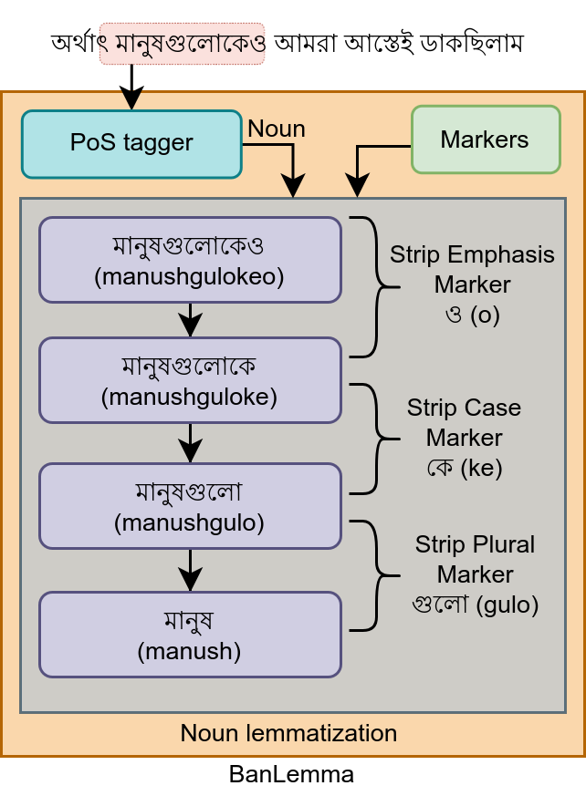

# BanLemma  <!-- omit in toc -->

BanLemma is a word formation dependent rule and dictionary based lemmatization system specifically developed for the Bangla language. This repository contains the datasets described in the paper titled *"BanLemma: A Word Formation Dependent Rule and Dictionary Based Bangla Lemmatizer"*. In this study, we present an innovative approach to solve the lemmatization challenge in the Bangla language.

## Table of Contents  <!-- omit in toc -->

- [Directory structure](#directory-structure)
- [Key contributions](#key-contributions)
- [How BanLemma works](#how-banlemma-works)
- [How to use](#how-to-use)
- [Results](#results)
- [Acknowledgment](#acknowledgment)
- [Citation](#citation)


## Directory structure

This repository has the following directory structure:

```bash
.
├── data
│   ├── analysis-dataset  # contains the words used for analysis
│   ├── markers  # contains the list of markers
│   ├── sample  # contains a sample dictionary
│   └── test-dataset  # contains the test datasets
├── banlemma  # contains the code
└── README.md
```

## Key contributions

The primary contributions of this study include the introduction of "BanLemma", a specialized lemmatization system tailored for Bangla, which outperforms existing methods. We provide a set of linguistical rules that elucidate the derivation process of inflected words in the Bangla language. These rules are derived from an extensive Bangla text corpus, comprising 90.65 million unique sentences and 0.5 billion words, with 6.17 million distinct words. Our systematic analysis of 22,131 words is the largest experimentation of its kind in Bangla.

During evaluation, we employ intra-dataset and cross-dataset testing, demonstrating the robustness and superior performance of our system. In intra-dataset testing, we achieve 96.36% accuracy, and in cross-dataset testing, BanLemma surpasses other recently published methodologies, showcasing significant performance improvements ranging from 1% to 11%. This indicates the robustness of our proposed BanLemma lemmatization system.

## How BanLemma works

In contrast to traditional rule-based approaches, our method takes into account both the suffix markers and the Part of Speech (PoS) class of Bangla words. This approach involves a sequential analysis and stripping of suffix markers to precisely obtain the base form or lemma, as demonstrated in the figure below:



For a more comprehensive understanding of the rules development and lemmatization methodology, please refer to the accompanying paper.

## How to use

At first clone this repository. Then we need to prepare data. Data preparation requires the markers list, suffixes list for verbs, and the dictionary. The `prepare_data.py` script can be used to prepare data which takes the following arguments:

```bash
--dictionary       File path to the word-lemma dictionary.
--markers_dir      Directory path containing list of markers' files.
--verb_suffixes    File path to the list of verb suffixes
```

Once done, use `banlemma` like following:

```python
import banlemma

text = "আমরা বাংলাদেশের মানুষেরা অনেক অতিথি পরায়ণ"
lemma = banlemma.lemmatize(text)

print(lemma)
# >>> আমরা বাংলাদেশ মানুষ অনেক অতিথি পরায়ণ
```

## Results

Using human annotated PoS tags, BanLemma achieves an accuracy of *96.36%*. The following table summarizes the PoS wise and overall performance of the lemmatizer in terms of accuracy using the human annotated test dataset. *All*, *CSCL*, *NOAD*, and *NOD* represents the dataset of **all** text, **c**la**s**si**c**a**l** text, **N**o **O**verlap with **A**nalysis **D**ataset and **N**o **O**verlap with **D**ictionary respectively. Others indicates all other PoS classes except the considered PoS classes. For the "others" class, the word itself is considered as its lemma and there was no non-overlapping Postposition for NOAD and NOD datasets.

| PoS          | All    | CSCL   | NOAD   | NOD    |
| ------------ | ------ | ------ | ------ | ------ |
| Noun         | 95.20  | 94.89  | 94.60  | 90.79  |
| Pronoun      | 94.28  | 93.59  | 94.12  | 87.50  |
| Verb         | 95.12  | 96.58  | 84.11  | 78.26  |
| Adverb       | 96.88  | 96.15  | 96.67  | 98.28  |
| Adjective    | 96.93  | 98.11  | 98.40  | 97.47  |
| Postposition | 100.00 | 100.00 | -      | -      |
| Others       | 100.00 | 100.00 | 100.00 | 100.00 |
| Overall      | 96.36  | 96.48  | 96.41  | 96.32  |

We also measure the impact of using an automatic PoS tagger to get the tags of each word. The following table summarizes the results:

|    Metric     | Human annotated PoS | BNLP PoS tagger | ISI PoS tagger |
| :-----------: | :-----------------: | :-------------: | :------------: |
| Accuracy (\%) |        96.67        |      89.32      |     84.77      |

We then conduct an cross dataset evaluation and the result is summarized in the table below:

<style type="text/css">
.tg  {border-collapse:collapse;border-spacing:0;}
.tg td{border-style:solid;border-width:1px;font-family:Arial, sans-serif;font-size:14px;
  overflow:hidden;padding:10px 5px;word-break:normal;}
.tg th{border-style:solid;border-width:1px;font-family:Arial, sans-serif;font-size:14px;
  font-weight:bold;overflow:hidden;padding:10px 5px;word-break:normal;}
.tg .tg-0lax{text-align:center;vertical-align:top}
</style>
<table class="tg">
<thead>
  <tr>
    <th class="tg-0lax">Test dataset</th>
    <th class="tg-0lax">Study</th>
    <th class="tg-0lax">Accuracy</th>
    <th class="tg-0lax">Character Accuracy</th>
  </tr>
</thead>
<tbody>
  <tr>
    <td class="tg-0lax" rowspan="2">BenLem</td>
    <td class="tg-0lax">BenLem</td>
    <td class="tg-0lax">81.95</td>
    <td class="tg-0lax">-</td>
  </tr>
  <tr>
    <td class="tg-0lax">Ours</td>
    <td class="tg-0lax">93.58</td>
    <td class="tg-0lax">-</td>
  </tr>
  <tr>
    <td class="tg-0lax" rowspan="2">BaNeL</td>
    <td class="tg-0lax">BaNeL</td>
    <td class="tg-0lax">-</td>
    <td class="tg-0lax">95.75</td>
  </tr>
  <tr>
    <td class="tg-0lax">Ours*</td>
    <td class="tg-0lax">-</td>
    <td class="tg-0lax">94.80</td>
  </tr>
  <tr>
    <td class="tg-0lax" rowspan="2">Chakrabarty et al.</td>
    <td class="tg-0lax">Chakrabarty et al.</td>
    <td class="tg-0lax">91.14</td>
    <td class="tg-0lax">-</td>
  </tr>
  <tr>
    <td class="tg-0lax">Ours</td>
    <td class="tg-0lax">80.08</td>
    <td class="tg-0lax">-</td>
  </tr>
</tbody>
</table>

*\* We report the performance on the entire dataset of BaNeL while they reported the metric on a test split from the entire dataset.*

Initially we found that our system exhibits lower performance on the test dataset provided by *Chakrabarty et al*. Several factors contribute to this performance gap, including the reliance on an automatic PoS tagger, which introduced inherent errors. Further investigation reveals significant inconsistency between the dataset used in their study and our considerations during the development of the lemmatizer. These inconsistencies are discussed in detail in Appendix A.9 in the paper.

To evaluate the performance of our proposed system on the dataset provided by *Chakrabarty et al.*, we manually annotated and corrected PoS tags and lemmas. We focused on 52 sentences comprising a total of 695 words. Additionally, we reviewed and corrected about 2000 lemmas from the BaNeL dataset. The results of our evaluation are summarized in the following table:

| Dataset            | Acc.  | A-PoS | C-PoS; C-Lem. |
| ------------------ | ----- | ----- | ------------- |
| Chakrabarty et al. | 79.97 | 87.09 | 94.34         |
| BaNeL              | 96.36 | -     | 98.99         |

## Acknowledgment

We would like to express our gratitude to the "Bangla Syntactic Treebank Corpus With Processing Pipeline and Distribution Platform" project, which is part of the "Enhancement of Bangla Language in ICT through Research & Development" ([EBLICT](http://eblict.gov.bd/)) initiative, supported by the [Bangladesh Computer Council](https://bcc.gov.bd/) under the [ICT Division](https://ictd.gov.bd/) of the Government of Bangladesh. We extend our sincere appreciation to the dedicated development consultant team at [Giga Tech Limited](https://gigatechltd.com/) and the diligent testing consultant team from [Bangladesh University of Engineering & Technology](https://www.buet.ac.bd/). Furthermore, we would like to acknowledge the invaluable financial support provided by the People's Republic of Bangladesh, which enabled the successful execution of this research.

## Citation

To cite our work:

```bib
@inproceedings{
    afrin2023banlemma,
    title={BanLemma: A Word Formation Dependent Rule and Dictionary Based Bangla Lemmatizer},
    author={Afrin, Sadia and Chowdhury, Md. Shahad Mahmud and Islam, Md. Ekramul and Khan, Faisal Ahamed and Chowdhury, Labib Imam and Mahtab, MD. Motahar and Chowdhury, Nazifa Nuha and Forkan, Massud and Kundu, Neelima and Arif, Hakim and Mohammad Mamun Or Rashid and Amin, Mohammad Ruhul and Mohammed, Nabeel},
    booktitle={The 2023 Conference on Empirical Methods in Natural Language Processing},
    year={2023}
}
```